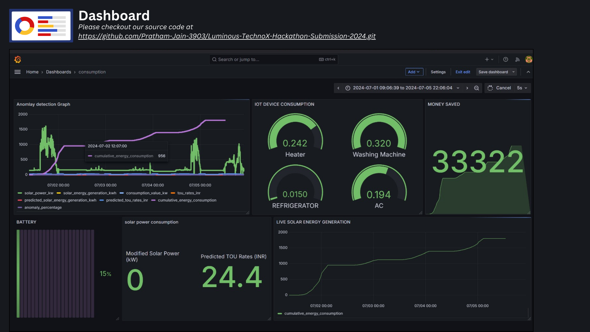
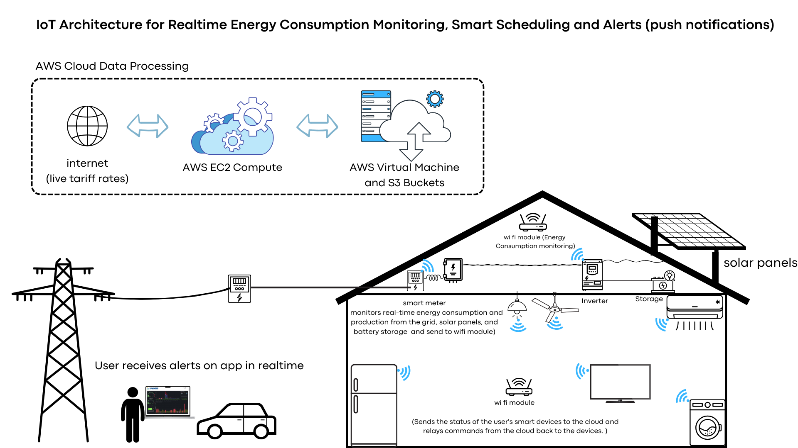
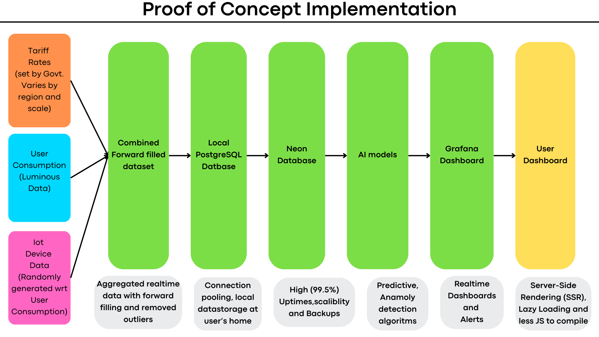
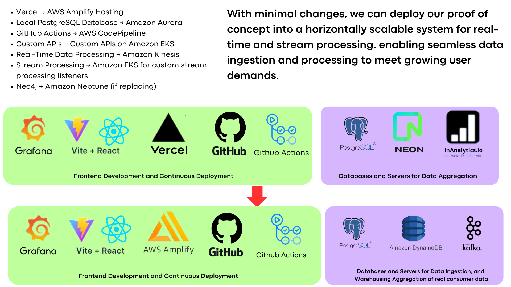

# Luminous-TechnoX-Hackathon-Submission-2024

Luminous TechnoX Hackathon Submission 2024 

# SolarWise: Dynamic AI-Driven Energy Management Cloud Solutions 🌞

 

## Overview

SolarWise is a comprehensive AI-driven energy management solution that integrates IoT devices, cloud computing, and machine learning to provide real-time monitoring, forecasting, and optimization of energy consumption. Our system focuses on maximizing solar energy utilization while minimizing costs through intelligent scheduling and real-time alerts.

##THE USERNAME & PASSWORD IS luminous 

## Dashboard Screenshots

- Solar Battery Levels Monitor
- Power Usage Analytics
- Energy Consumption Predictions
- Monthly Savings Calculator
- Device Status Overview
- Real-time Tariff Rates
- Anomaly Detection Alerts

## Key Features

### 1. Real-Time Monitoring
- Live solar power generation tracking
- Power consumption monitoring
- Connected IoT device status
- Battery level monitoring
- Cost savings calculations
- Time-of-Use (TOU) tariff tracking

### 2. AI-Powered Predictions
- **User Consumption Prediction (Linear Regression)**
  - R-squared value > 90%
  - Lightweight model for efficient computation
  - Quick insights generation

- **TOU Tariff Prediction (LSTM)**
  - 92% accuracy in rate predictions
  - Captures long-term dependencies
  - Adaptive learning capabilities

### 3. Smart Detection & Optimization
- **Anomaly Detection (Z-Score)**
  - 95% precision rate
  - Computationally efficient
  - Real-time monitoring capabilities

- **Device Scheduling (MILP)**
  - 100% optimal scheduling solutions
  - Efficient constraint handling
  - Cost-effective energy usage planning

## System Architecture

### IoT Integration Layer

### Cloud Infrastructure
1. **Data Ingestion & Processing**
   - Amazon Kinesis for real-time streaming
   - EKS-deployed stream processors
   - Custom protocol-specific data connectors

2. **Storage Solutions**
   - Amazon S3 for raw data
   - ElastiCache for quick access
   - DynamoDB for device states
   - Aurora for structured data
   - OpenSearch for analytics

3. **Processing & Analytics**
   - AWS Athena for serverless queries
   - Custom APIs on Amazon EKS
   - ML model deployment infrastructure
   - Real-time anomaly detection

4. **User Interface & Control**
   - Real-time dashboards
   - Push notifications
   - Device control interface
   - Savings analytics

## Implementation Details

 

### Data Flow Architecture

 

### Database Structure
- Local PostgreSQL for edge processing
- Neon Database for cloud storage
- Grafana for real-time visualization

### Model Performance
| Model Type         | Accuracy | Use Case                  |
|--------------------|----------|---------------------------|
| LSTM               | 92%      | Consumption Prediction    |
| Linear Regression  | 90%+     | Rate Prediction           |
| Z-Score            | 95%+     | Anomaly Detection         |
| MILP               | 100%     | Device Scheduling         |

## Deployment

### Prerequisites
- AWS Account with appropriate permissions
- IoT devices with WiFi capability
- Smart meters compatible with the system
- Internet connectivity

### AWS Services Required
- EC2
- EKS
- Kinesis
- S3
- ElastiCache
- DynamoDB
- Athena
- OpenSearch
- AWS Glue

## Why Choose SolarWise?

1. **Modular Architecture**
   - Scalable across regions
   - Handles large data volumes
   - Adaptable to various markets

3. **User Flexibility**
   - Remote monitoring
   - Anywhere access
   - Real-time control

4. **Intelligent Optimization**
   - Continuous learning
   - Adaptive to user behavior
   - Market-aware scheduling

5. **Robust Infrastructure**
   - 99.5% uptime
   - Scalable architecture
   - Secure data handling

## Implementation Note

To minimize costs associated with real-time compute on AWS SageMaker, we implemented models and pre-computed values for 7 days in advance. This setup emulates fetching these values from Grafana using aggregated database tables while ensuring a realistic user experience. 

## Data Sources

- **TOU Tariff Data**: Data generated using the **Tariff of Time of Use (ToU) Indian Power System Dataset** from [Mendeley Data](https://data.mendeley.com/datasets/7g9frz6sm8/1), normalized for commercial rates per unit. The system loops these values to simulate upcoming tariff rates.
- **Solar Power Generation & Consumption**: Cleaned data provided by **Luminous** after the initial Q&A session, looped to mimic continuous solar power generation and consumption.

Our ML models were trained using the above split and augmented data, validated against actual user consumption data from **InAnalytics**. This serves as a robust baseline for real consumer data 
integration.

### We have utilized the Pycarat library for quick prototyping and trial and error on over 20 ML models for each prediction feature

## License

This project is licensed under no License. Please dont reuse this file. 

*Note: This project was developed as part of the Luminous TechnoX Hackathon 2024*
